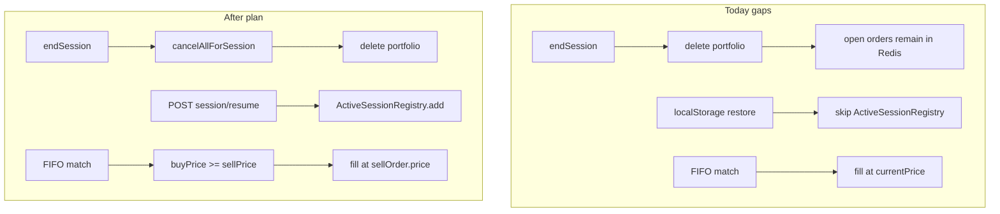

# Market.io Coherence Implementation Plan

> **For agentic workers:** REQUIRED SUB-SKILL: Use superpowers:subagent-driven-development (recommended) or superpowers:executing-plans to implement this plan task-by-task. Steps use checkbox (`- [ ]`) syntax for tracking.

**Goal:** Align session/order lifecycle, P2P matching semantics, configuration, documentation, and frontend restore with the hybrid trading model already implemented in code.

**Architecture:** Introduce a small `OrderCancellationService` called before portfolio deletion on session end; add `POST /session/resume` to re-register restored browser sessions; tighten `MatchingEngine` FIFO to resting prices with a price-cross guard; wire `INITIAL_CASH` from environment; update README/UI labels to say orders are posted at the current market quote (not arbitrary limits). Defer per-order `DELETE /orders/{id}` cancel API (YAGNI—session end covers ghost orders).

**Tech Stack:** PHP 8.2 (custom router), Redis, vanilla JS frontend, Docker Compose test runner.

**Save copy to:** [`docs/superpowers/plans/2026-05-23-market-coherence.md`](docs/superpowers/plans/2026-05-23-market-coherence.md) when implementing (directory does not exist yet).

---

## Current vs target (engine)



---

## File map

| File | Responsibility |
|------|----------------|
| [`market/backend/config/app.php`](market/backend/config/app.php) | Read `INITIAL_CASH` from env |
| [`market/backend/src/Domain/Entity/Order.php`](market/backend/src/Domain/Entity/Order.php) | Add `cancel()` → status `cancelled` |
| [`market/backend/src/Application/OrderCancellationService.php`](market/backend/src/Application/OrderCancellationService.php) | **New** — unlock collateral, remove from queues |
| [`market/backend/src/Application/MatchingEngine.php`](market/backend/src/Application/MatchingEngine.php) | Price-cross guard + fill at resting sell price |
| [`market/backend/src/Controller/SessionController.php`](market/backend/src/Controller/SessionController.php) | Call cancel on end; add `resume` |
| [`market/backend/config/routes.php`](market/backend/config/routes.php) | `POST /session/resume` |
| [`market/backend/bootstrap.php`](market/backend/bootstrap.php) | Wire `OrderCancellationService` into `SessionController` |
| [`market/backend/tests/run.php`](market/backend/tests/run.php) | New regression tests |
| [`market/frontend/js/api.js`](market/frontend/js/api.js) | `resumeSession(sessionId)` |
| [`market/frontend/js/app.js`](market/frontend/js/app.js) | Resume on restore; refresh leaderboard after trades |
| [`market/frontend/index.html`](market/frontend/index.html) | Czech labels: Post → Post za tržní cenu |
| [`market/README.md`](market/README.md) | Hybrid trading + full API surface |
| [`market/backend/ARCHITECTURE.md`](market/backend/ARCHITECTURE.md) | Session end cleanup + resume + FIFO semantics |

---

### Task 1: Wire `INITIAL_CASH` from environment

**Files:**
- Modify: [`market/backend/config/app.php`](market/backend/config/app.php)

- [ ] **Step 1: Replace hardcoded cash**

```php
$initialCashEnv = getenv('INITIAL_CASH');
$initialCash = $initialCashEnv !== false && $initialCashEnv !== ''
    ? (float) $initialCashEnv
    : 10000.0;

return [
    // ...
    'initial_cash' => $initialCash,
```

- [ ] **Step 2: Add failing test in** [`market/backend/tests/run.php`](market/backend/tests/run.php)

```php
$tests['Session starts with configured initial cash'] = static function (): void {
    putenv('INITIAL_CASH=5000');
    $app = require __DIR__ . '/../bootstrap.php';
    $sessionService = $app['controllers']['session']; // OR rebuild SessionService with config
    // Prefer: read $app config if exposed, or instantiate SessionService(..., 5000.0) directly
    $session = (new SessionService(new SessionRepository(), new PortfolioRepository(), 5000.0))
        ->startSession('CashTest');
    assertTrue((float) $session['cash'] === 5000.0, 'Initial cash from config');
    putenv('INITIAL_CASH'); // unset
};
```

If bootstrap does not re-read env per test, assert via direct `SessionService` construction with value from a tiny helper that mirrors `app.php` logic—keep test independent of Docker env pollution.

- [ ] **Step 3: Run tests**

```powershell
cd d:\Commerzbank\Webapp_praxe\market
docker compose exec -T api php tests/run.php
```

Expected: all PASS including new test.

- [ ] **Step 4: Commit** (only if user asked)

---

### Task 2: Order cancellation on session end

**Files:**
- Modify: [`market/backend/src/Domain/Entity/Order.php`](market/backend/src/Domain/Entity/Order.php)
- Create: [`market/backend/src/Application/OrderCancellationService.php`](market/backend/src/Application/OrderCancellationService.php)
- Modify: [`market/backend/src/Controller/SessionController.php`](market/backend/src/Controller/SessionController.php)
- Modify: [`market/backend/bootstrap.php`](market/backend/bootstrap.php)

- [ ] **Step 1: Add `cancel()` on Order**

```php
public function cancel(): void
{
    if (!$this->isOpen()) {
        throw new \DomainException('Order is not open');
    }
    $this->remainingQty = 0;
    $this->status = 'cancelled';
}
```

- [ ] **Step 2: Write failing test** in [`market/backend/tests/run.php`](market/backend/tests/run.php)

```php
$tests['End session cancels open orders and unlocks collateral'] = static function (): void {
    [$orderService, $sessionService, $portfolioRepo, , $orderRepo] = buildOrderFixture();
    $session = $sessionService->startSession('Leaver2');
    $sessionId = (string) $session['sessionId'];

    $orderService->placeOrder($sessionId, 'asset-1', 'buy', 2, 'limit');
    $openBefore = $orderRepo->findOpenBySession($sessionId);
    assertTrue(count($openBefore) === 1, 'Order posted');

    $cashLocked = $portfolioRepo->find($sessionId)?->getCash() ?? -1;
    assertTrue($cashLocked < 10000.0, 'Cash locked for buy post');

    // Invoke cancellation the same way SessionController will
    $cancellation = new OrderCancellationService($orderRepo, $portfolioRepo, $eventPublisherStub);
    $cancellation->cancelAllForSession($sessionId);

    assertTrue(count($orderRepo->findOpenBySession($sessionId)) === 0, 'No open orders');
    assertTrue($portfolioRepo->find($sessionId)?->getCash() === 10000.0, 'Cash unlocked');

    $sessionService->endSession($sessionId);
};
```

Adapt fixture helper to expose `$orderRepo` / stub `EventPublisher` if needed.

- [ ] **Step 3: Implement `OrderCancellationService`**

```php
final class OrderCancellationService
{
    public function __construct(
        private readonly object $orderRepository,
        private readonly object $portfolioRepository,
        private readonly ?EventPublisher $eventPublisher = null
    ) {}

    public function cancelAllForSession(string $sessionId): void
    {
        $portfolio = $this->portfolioRepository->find($sessionId);
        if ($portfolio === null) {
            return;
        }

        $assetIds = [];
        foreach ($this->orderRepository->findOpenBySession($sessionId) as $order) {
            $remaining = $order->getRemainingQty();
            if ($order->getSide() === 'buy') {
                $portfolio->creditCash(round($remaining * $order->getPrice(), 2));
            } else {
                $portfolio->creditShares($order->getAssetId(), $remaining, $order->getPrice());
            }
            $order->cancel();
            $this->orderRepository->removeFromQueue($order);
            $this->orderRepository->save($order);
            $assetIds[$order->getAssetId()] = true;
        }

        $this->portfolioRepository->save($sessionId, $portfolio);

        foreach (array_keys($assetIds) as $assetId) {
            $this->eventPublisher?->publishOrderBook($assetId);
        }
    }
}
```

Verify `EventPublisher` has `publishOrderBook` (or existing orderbook publish method used elsewhere—grep and call the same).

- [ ] **Step 4: Call from `SessionController::end` before `endSession`**

```php
$this->orderCancellationService->cancelAllForSession($sessionId);
// then existing leaderboard + endSession
```

- [ ] **Step 5: Wire in** [`market/backend/bootstrap.php`](market/backend/bootstrap.php)

```php
$orderCancellationService = new Market\Application\OrderCancellationService(
    $orderRepository,
    $portfolioRepository,
    $eventPublisher
);
'session' => new SessionController(
    $sessionService,
    $leaderboardService,
    $activeSessionRegistry,
    $orderCancellationService
),
```

- [ ] **Step 6: Run tests** — expect PASS; extend test to assert Redis queue depth `0` if using integration fixture with Redis (optional in Docker).

---

### Task 3: Session resume for localStorage restore

**Files:**
- Modify: [`market/backend/config/routes.php`](market/backend/config/routes.php)
- Modify: [`market/backend/src/Controller/SessionController.php`](market/backend/src/Controller/SessionController.php)
- Modify: [`market/frontend/js/api.js`](market/frontend/js/api.js)
- Modify: [`market/frontend/js/app.js`](market/frontend/js/app.js)

- [ ] **Step 1: Failing route test** in [`market/backend/tests/run.php`](market/backend/tests/run.php)

```php
$tests['Session resume re-registers active session'] = static function (): void {
    $app = require __DIR__ . '/../bootstrap.php';
    $router = $app['router'];

    $start = json_decode($router->dispatch(
        new Request('POST', '/session/start', [], [], [], json_encode(['nickname' => 'ResumeMe']))
    )->getBody(), true);
    $sessionId = $start['session']['sessionId'];

    $resume = json_decode($router->dispatch(
        new Request('POST', '/session/resume', [], [], [], json_encode(['sessionId' => $sessionId]))
    )->getBody(), true);

    assertTrue(($resume['ok'] ?? false) === true, 'Resume ok');
    // Assert ActiveSessionRegistry contains sessionId (inject registry in test or check leaderboard sync side effect)
};
```

- [ ] **Step 2: Add route**

```php
['method' => 'POST', 'path' => '/session/resume', 'controller' => 'session', 'action' => 'resume'],
```

- [ ] **Step 3: Implement `SessionController::resume`**

```php
public function resume(Request $request, array $params = []): Response
{
    $sessionId = (string) $request->input('sessionId', '');
    if ($sessionId === '') {
        return JsonResponse::error('sessionId is required', 422, 'validation_error');
    }

    $session = $this->sessionService->getSession($sessionId);
    if ($session === null) {
        return JsonResponse::error('Session not found', 404, 'not_found');
    }

    $this->activeSessionRegistry->add($sessionId);
    $this->leaderboardService->syncLive($sessionId);

    return JsonResponse::success(['session' => $session->toArray()]);
}
```

- [ ] **Step 4: Frontend API**

```javascript
resumeSession(sessionId) {
  return request('/session/resume', {
    method: 'POST',
    body: JSON.stringify({ sessionId }),
  });
},
```

- [ ] **Step 5: Call on restore block** in [`market/frontend/js/app.js`](market/frontend/js/app.js) (~line 553)

```javascript
if (state.sessionId) {
  // ... existing UI show ...
  apiCall(() => api.resumeSession(state.sessionId))
    .then(() => refreshAll())
    .then(() => startPricePoll())
    .catch(/* existing clearSession */);
}
```

- [ ] **Step 6: Run tests + manual check** — reload page with active session; live leaderboard should update on price tick without placing a new trade.

---

### Task 4: FIFO matching at resting price (pragmatic P2P fix)

**Files:**
- Modify: [`market/backend/src/Application/MatchingEngine.php`](market/backend/src/Application/MatchingEngine.php)
- Modify: [`market/frontend/index.html`](market/frontend/index.html), [`market/frontend/js/app.js`](market/frontend/js/app.js) (labels/toasts only)

- [ ] **Step 1: Failing test** — two players post buy/sell at same price, prices tick upward, FIFO still fills at posted price:

```php
$tests['FIFO matches at resting sell price when prices cross'] = static function (): void {
    // Player A post sell 1 @ 100, Player B post buy 1 @ 100
    // Asset lastPrice moves to 105
    // match('asset-1', 105) should still produce trade at 100.0
};
```

- [ ] **Step 2: Update `match()` loop** before `executeQueuedPair`:

```php
if ($buyOrder->getPrice() < $sellOrder->getPrice()) {
    $this->orderRepository->requeueFront($buyOrder);
    $this->orderRepository->requeueFront($sellOrder);
    break;
}

$fillPrice = $sellOrder->getPrice();
$trade = $this->executeQueuedPair($buyOrder, $sellOrder, $fillPrice);
```

- [ ] **Step 3: Ensure `executeQueuedPair` uses `$fillPrice` consistently** for `tradeCost`, `creditShares`, and `Trade::create` (replace `$currentPrice` parameter usage inside method body).

- [ ] **Step 4: Rename UI copy**

| Location | From | To |
|----------|------|-----|
| `index.html` hint | `Post = nabídka do order booku` | `Post = nabídka do booku za aktuální tržní cenu` |
| Buttons | `Post Nákup` / `Post Prodej` | `Post nákup (tržní)` / `Post prodej (tržní)` |
| `app.js` toast | `Limitní objednávka` | `Objednávka v booku (tržní cena)` |

Keep API mode `limit` unchanged (backward compatible).

- [ ] **Step 5: Run full test suite** — update existing FIFO test expectations if fill price assertion changed.

---

### Task 5: Frontend leaderboard refresh without WebSocket

**Files:**
- Modify: [`market/frontend/js/app.js`](market/frontend/js/app.js)

- [ ] **Step 1: After successful `placeTrade` and `takeOrder`**, add:

```javascript
const lb = await api.getLeaderboard();
renderLeaderboard(lb.items);
```

inside the existing `try` block after portfolio/orderbook updates (no new test—manual verify).

- [ ] **Step 2: Manual verify** — trade with WS disconnected (or single browser): leaderboard row updates for current player.

---

### Task 6: Documentation coherence

**Files:**
- Modify: [`market/README.md`](market/README.md)
- Modify: [`market/backend/ARCHITECTURE.md`](market/backend/ARCHITECTURE.md)

- [ ] **Step 1: Rewrite README "How trading works"** to describe:
  - Simulated prices (`GET /assets/tick`, WS `price_tick`)
  - **Market** `POST /orders` `{ mode: "market" }` — instant fill vs exchange
  - **Post** `mode: "limit"` — queue at current `lastPrice`, not custom limit
  - **Take** `POST /orders/{id}/take`
  - **Transactions** `GET /transactions?sessionId=`
  - **Session** `start`, `resume`, `end`
  - Dev: `npm run dev` from [`market/package.json`](market/package.json)

- [ ] **Step 2: ARCHITECTURE.md** — document `OrderCancellationService`, resume endpoint, FIFO fill rule (`buyPrice >= sellPrice`, fill at sell price).

- [ ] **Step 3: No automated doc test** — reviewer reads README against [`market/backend/config/routes.php`](market/backend/config/routes.php).

---

## Verification gate (required before claiming done)

Run in [`market/`](market/) with Docker up:

```powershell
docker compose up -d
docker compose exec -T api php tests/run.php
docker compose exec -T api php tests/smoke.php
docker compose exec -T api php tests/price_persistence.php
```

**Pass criteria:** `Passed: N, Failed: 0` (N = prior 19 + new tests), smoke OK, Redis prices move.

**Manual checklist:**

1. Post buy → End session → order book row gone; second browser cannot take old order id.
2. Reload page mid-session → leaderboard still moves on tick.
3. Two browsers: post sell + post buy → FIFO trade at posted price even after tick.
4. `INITIAL_CASH=5000` in `.env` + rebuild → new session starts with 5000 cash.

---

## Out of scope (explicit YAGNI)

- User-entered limit prices in UI
- `DELETE /orders/{id}` cancel endpoint (session end cleanup sufficient for now)
- Hall of fame HTTP endpoint (`topHallOfFame` already internal)
- Refactoring duplicate `AssetService` wiring in `bootstrap.php`

---

## Self-review (spec coverage)

| Prior gap | Task |
|-----------|------|
| README stale | Task 6 |
| Session end ghost orders | Task 2 |
| localStorage restore / registry | Task 3 |
| `INITIAL_CASH` env | Task 1 |
| P2P naming + FIFO economics | Task 4 |
| Leaderboard after own trade | Task 5 |

No placeholders; all tasks have concrete files and code shapes.
